<p align="center">
  <a href="https://resell.store">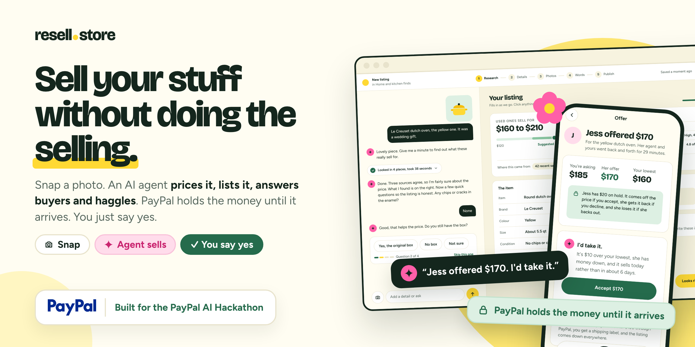</a>
</p>

<p align="center">
  <a href="https://resell.store"></a>
  <a href="https://www.youtube.com/watch?v=Nus5lpO5wL0"></a>
  <a href="https://paypalaihackathon.devpost.com/"></a>
  <a href="https://docs.resell.store"></a>
  <a href="LICENSE"></a>
</p>

# resell.store

**Sell your stuff without doing the selling.**

Snap a photo. An AI agent works out a fair price, writes the listing, puts it live in your own shop, answers buyers and haggles with their agents. PayPal holds the money until the item arrives. You just say yes.

The average home is full of things nobody uses. They stay in the cupboard because selling is a chore: pricing, photos, listing copy, "is this still available?" twenty times, lowballers, scams. resell.store hands all of it to an agent and keeps you in charge.

## What it does

- 📸 **One photo to a priced listing.** The agent identifies the item, checks what it costs new and what the same thing is listed for on eBay, Poshmark and Depop right now, then suggests a price.
- 🏪 **Your own shop.** Every seller gets a storefront on their own subdomain, like `claspandcarry.resell.store`, searchable by meaning, not just keywords.
- 💬 **An agent that answers buyers.** Questions get answered from the listing's facts, at any hour.
- 🤝 **An agent that haggles.** Low offers get countered inside the limits you set. It never goes under your lowest, and good offers wait for your yes.
- 🔒 **Money held until it arrives.** Buyers pay with PayPal or a card. The money waits at PayPal and lands in your own PayPal once the item arrives.
- 🛍️ **A shopping sidekick.** Paste a link before you buy and find out if it's worth it, or what it'll be worth later.
- 🤖 **Bring your own AI.** A public API and two MCP servers let any assistant run a shop or go shopping, with guardrails.

## How it works

<p align="center">
  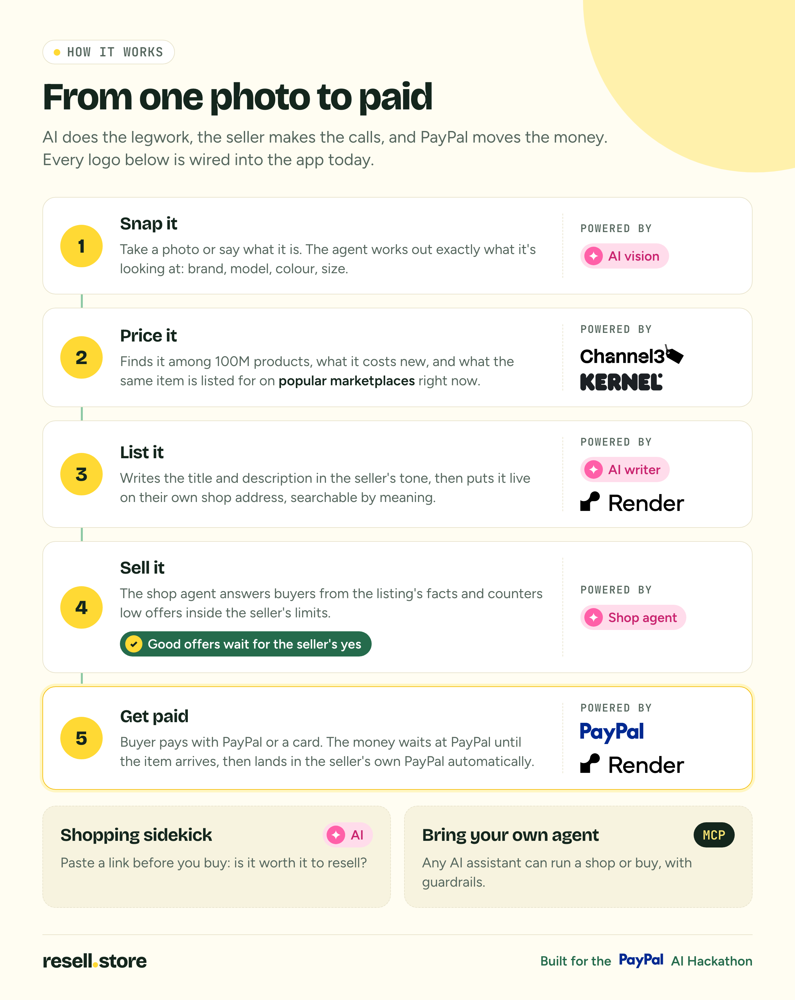
</p>

### One sale, start to finish

Maya sells her yellow dutch oven to Jess. Maya snaps a photo and ships. Her shop's agent does the talking and the haggling, and PayPal holds the money until the pot arrives.

<table>
  <tr>
    <td width="50%">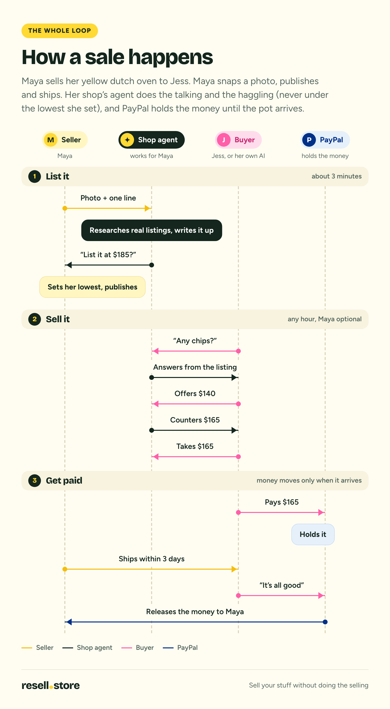</td>
    <td width="50%">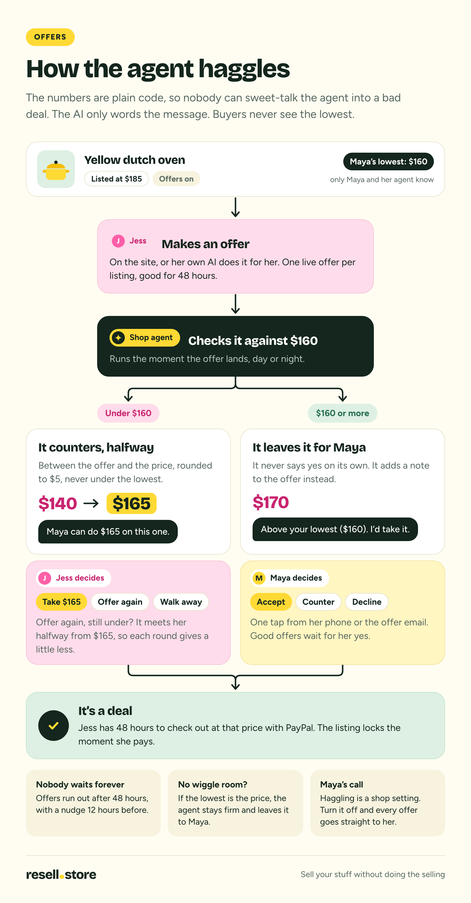</td>
  </tr>
</table>

<details>
<summary><b>More diagrams: research, agents, PayPal, sidekick, MCP, architecture</b></summary>
<br>

|                                                                                                             |                                                                                                                        |
| ----------------------------------------------------------------------------------------------------------- | ---------------------------------------------------------------------------------------------------------------------- |
| 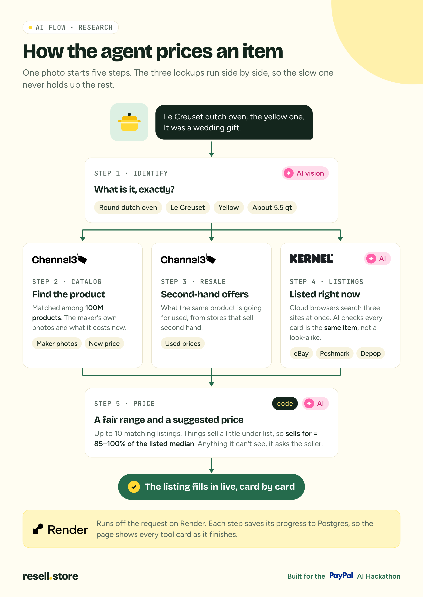     | 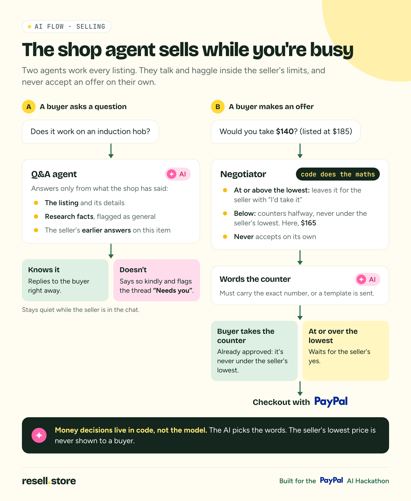             |
| 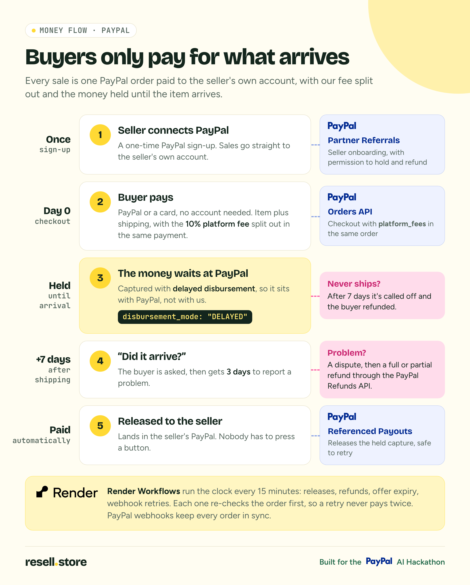 | 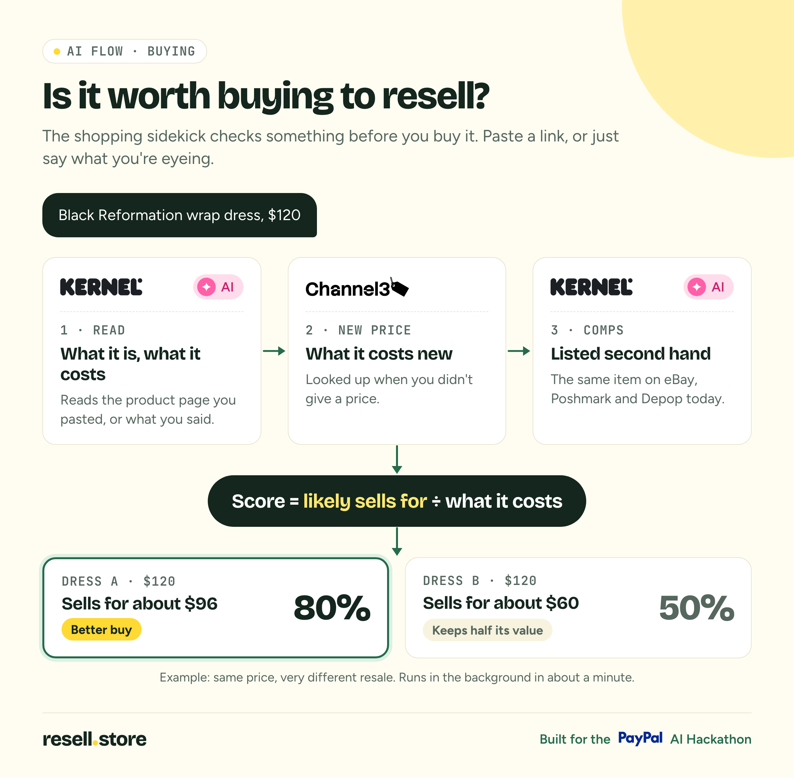                             |
| 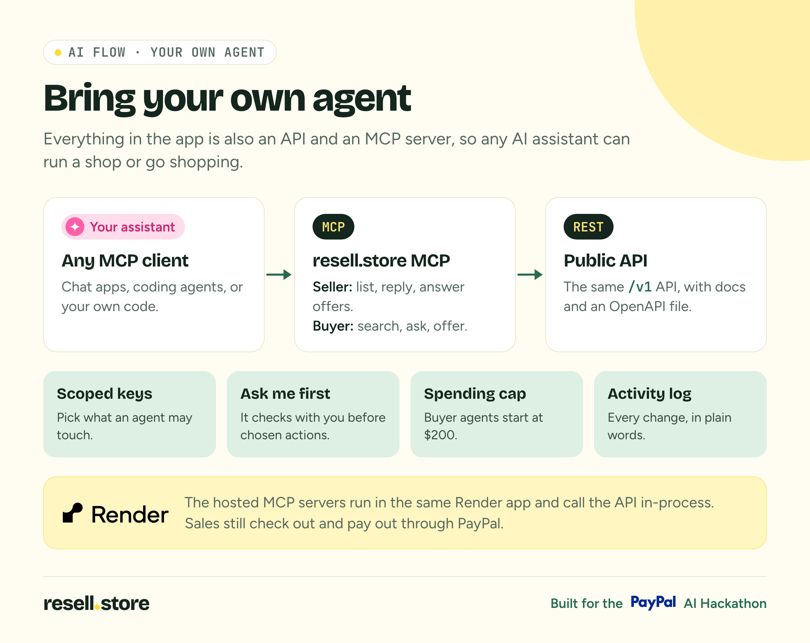                     | 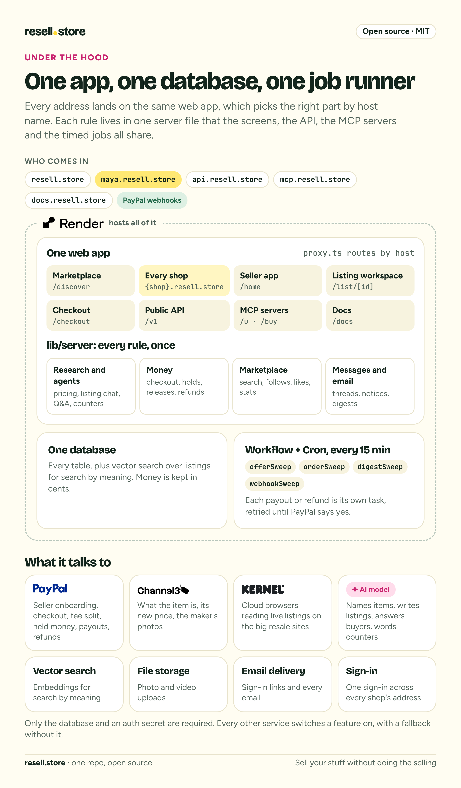                                                               |
| 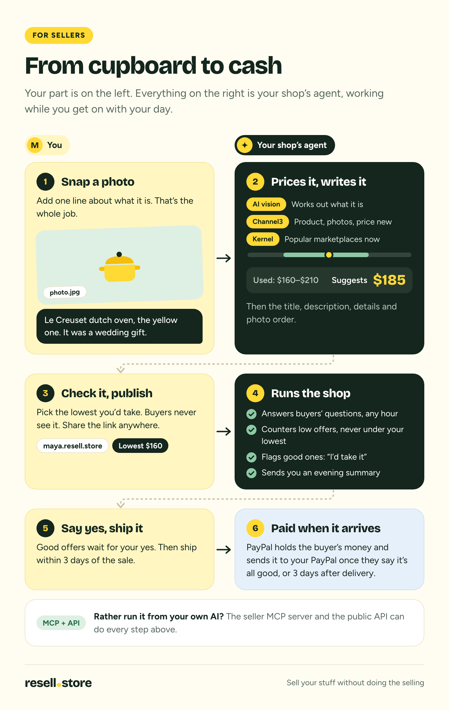                                      | 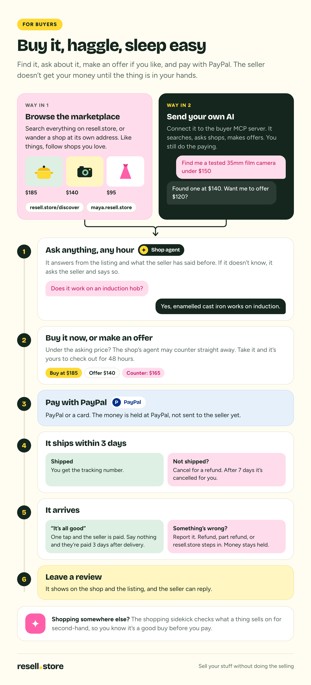 |

Sources and rebuild scripts live in [`docs/devpost`](docs/devpost).

</details>

## Built for the PayPal AI Hackathon

resell.store is our entry to the [PayPal AI Hackathon](https://paypalaihackathon.devpost.com/). Every sponsor below is wired into the code today, not just planned.

| Sponsor                                            | What it does in resell.store                                                                                                                |
| -------------------------------------------------- | ------------------------------------------------------------------------------------------------------------------------------------------- |
| [**PayPal**](https://developer.paypal.com/)        | Checkout straight to the seller's PayPal with our fee split in, money held until the item arrives, then payouts, refunds and disputes       |
| [**Channel3**](https://trychannel3.com/developers) | Names the item from 100M products, finds what it costs new and pulls the maker's photos                                                     |
| [**Kernel**](https://www.kernel.sh/)               | Cloud browsers that read live eBay, Poshmark and Depop listings for the same item, for pricing and the sidekick                             |
| [**Render**](https://render.com/)                  | Hosts the app, every shop subdomain and Postgres with pgvector, and runs the timed jobs: payouts, offer expiry, digests and webhook retries |

<p align="center">
  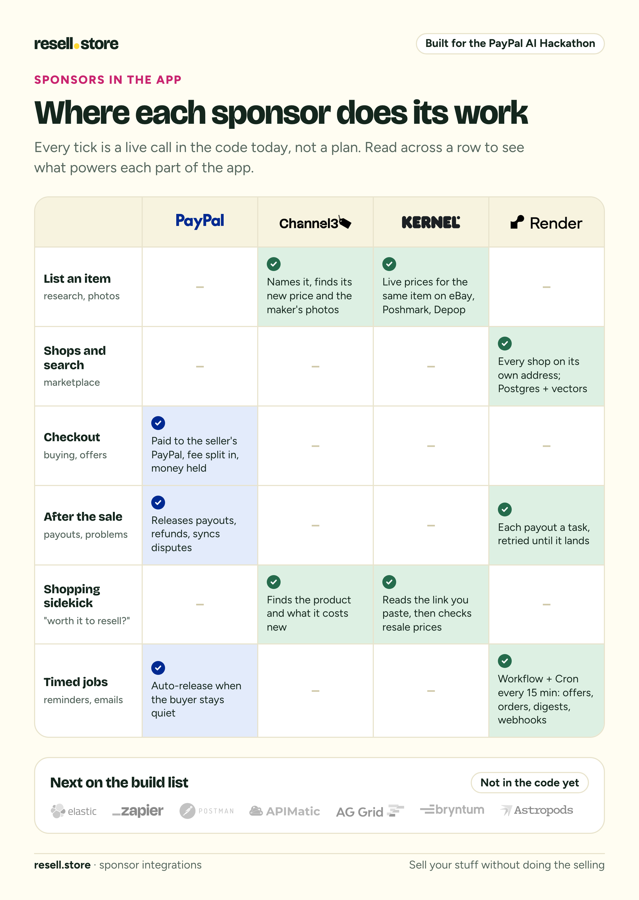
</p>

## Try it

- 🛒 **Shop:** [resell.store](https://resell.store), or visit a seeded store like [claspandcarry.resell.store](https://claspandcarry.resell.store)
- 🎬 **Watch:** the [2-minute demo](https://www.youtube.com/watch?v=Nus5lpO5wL0)
- 📚 **Read:** guides for sellers and buyers, the API and MCP reference, and developer docs at [docs.resell.store](https://docs.resell.store)
- 🔌 **Connect your AI:** the API lives at [api.resell.store](https://api.resell.store/v1/openapi.json), the MCP servers at `mcp.resell.store`

PayPal runs in sandbox mode, so no real money moves.

---

## For developers

A Turborepo monorepo on pnpm. Everything is documented on the docs site (`apps/app/app/docs`): [docs.resell.store](https://docs.resell.store) in production, http://localhost:5689/docs locally.

- **Guides:** selling and buying on resell.store (`/docs/guides/*`)
- **API and MCP:** the public API reference, recipes, and connecting your own AI (`/docs/api`, `/docs/mcp`)
- **Developers:** running it locally, how it's structured, deploying to Render, environment variables, and how PayPal, the AI model, Channel3, Kernel and Render are used (`/docs/dev`)

### Getting started

```sh
cp apps/app/.env.example apps/app/.env.local   # then fill in the keys
pnpm install
pnpm db:up        # Postgres + pgvector in Docker, on port 5433
pnpm db:migrate
pnpm dev          # http://localhost:5689, stores at {slug}.localhost:5689
```

### Commands

```sh
pnpm dev          # run all apps
pnpm build        # build everything
pnpm lint
pnpm check-types
pnpm db:generate  # new migration after changing packages/db/src/schema.ts
pnpm db:migrate
pnpm db:studio
pnpm email        # preview the email templates at http://localhost:5690
```

### Apps and packages

- `apps/app`: the main Next.js app: marketing site, the seller app (`app/(app)`, `app/(workspace)`), and the public marketplace (`app/(market)`, store subdomains in `app/store/[store]`)
- `@repo/db`: Drizzle schema, migrations and client for Postgres (with pgvector)
- `@repo/ui`: the resell.store design system (from the Paper file "Resell.Store"), built on [Base UI](https://base-ui.com) and Tailwind CSS v4
  - tokens live in `packages/ui/src/styles.css`; import it after `@import "tailwindcss";` in an app's CSS
  - import components as `@repo/ui/button`, `@repo/ui/item-card`, …
  - see every foundation and component at `/design-system` in `apps/app`
- `@repo/email`: [React Email](https://react.email) templates: sign-in link, offer received, offer accepted/countered/declined, sold, shipped, new from a followed shop, the agent's evening summary
  - each template exports a component plus a subject builder; send with `sendEmail({ to, subject, react })` from `apps/app/lib/server/email.ts`
  - preview them all with `pnpm email` (http://localhost:5690). Images in emails come from `apps/app/public/email`
- `@repo/mcp`: the MCP servers (one for running your shops, one for shopping), built on the public API. Hosted by `apps/app` at `/api/mcp` (mcp.resell.store); `pnpm --filter @repo/mcp build` makes `dist/stdio.js` to run one locally with `RESELL_API_KEY`
- `@repo/eslint-config`: shared ESLint configs
- `@repo/typescript-config`: shared `tsconfig.json`s

### Services

- **Payments:** [PayPal](https://developer.paypal.com/) (sandbox)
- **Auth:** [Better Auth](https://better-auth.com) on the same Postgres. Email sign-in links (local dev shows the link on the page)
- **AI:** [AI SDK](https://ai-sdk.dev) with Anthropic; models come from `AI_MODEL` / `AI_MODEL_FAST`
- **Product research:** [Channel3](https://trychannel3.com/developers) and [Kernel](https://www.kernel.sh/)
- **Uploads:** [Cloudflare R2](https://developers.cloudflare.com/r2/) when `R2_*` is set, else Postgres; always served from `/api/files/{id}`
- **Search:** Postgres full text plus [Jina](https://jina.ai/embeddings) embeddings in pgvector
- **Hosting:** [Render](https://render.com), see `render.yaml`. The backend plan is in `docs/backend-plan.md`

### Deploying to Render

`render.yaml` is a Render Blueprint for the web service and its Postgres database. In Render, choose **New → Blueprint**, pick the repo, then fill in the keys marked `sync: false`. The full guide is at `/docs/dev/deploy`.

On every deploy, Render runs:

- Build: `corepack pnpm install --frozen-lockfile && corepack pnpm --filter app build`. pnpm runs through corepack because `corepack enable` can't write to Render's read-only `/usr/bin`. `allowBuilds` in `pnpm-workspace.yaml` lets esbuild run its install script; pnpm 11 fails the install otherwise.
- Pre-deploy: `cd packages/db && npm run db:migrate`
- Start: `cd apps/app && npm start`

<details>
<summary><b>Custom domain and store subdomains</b></summary>
<br>

Every store lives on its own subdomain (`maya.resell.store`), and `api.`, `docs.` and `mcp.` are subdomains too. `proxy.ts` sends each one to the right part of the app, so the web service needs the root domain and a wildcard:

1. On the `resell-store` web service, open **Settings → Custom Domains** and add `resell.store`. Render adds `www.resell.store` too and redirects it to the root.
2. Add `*.resell.store`. Render shows three DNS records for it. Wildcards only work if the root domain also points to Render.
3. Add these records at your DNS provider. Copy the exact targets from the Render dashboard; `resell-store.onrender.com` stands in for your service's address.

   | Type    | Name                  | Value                                                                                             |
   | ------- | --------------------- | ------------------------------------------------------------------------------------------------- |
   | `A`     | `@`                   | `216.24.57.1` (or an `ALIAS`/`ANAME` to `resell-store.onrender.com` if your provider supports it) |
   | `CNAME` | `www`                 | `resell-store.onrender.com`                                                                       |
   | `CNAME` | `*`                   | `resell-store.onrender.com`                                                                       |
   | `CNAME` | `_acme-challenge`     | `<service-id>.verify.renderdns.com` (for the wildcard certificate)                                |
   | `CNAME` | `_cf-custom-hostname` | `<service-id>.hostname.renderdns.com`                                                             |
   - Remove any `AAAA` records for the domain. Render doesn't support IPv6 for custom domains.
   - On Cloudflare, use a `CNAME` on `@` instead of the `A` record, and leave every record on **DNS only** (grey cloud) until Render has verified the domains and issued certificates. If you then turn on the proxy, set SSL/TLS to **Full**.

4. Click **Verify** on each domain in Render. Render issues and renews the TLS certificates, the wildcard's included.
5. Check that these env vars on the web service use the real domain, then trigger a new deploy, because `NEXT_PUBLIC_ROOT_DOMAIN` is baked in at build time:
   - `NEXT_PUBLIC_ROOT_DOMAIN=resell.store`
   - `BETTER_AUTH_URL=https://resell.store`

   They decide which hosts count as stores (`lib/urls.ts`) and put the session cookie on `.resell.store`, so a signed-in seller stays signed in on their store (`lib/server/auth.ts`).

To use a different domain, put it everywhere `resell.store` appears above. The app reads its domain only from those two variables.

Before the domains are live, the app loads at its `onrender.com` address, but store subdomains, the shared session and the `api.`/`docs.`/`mcp.` hosts won't work there.

Custom domains count toward your Render workspace's limit: Hobby includes two, and extras cost $0.25 a month each.

Once DNS has propagated, check that each of these loads:

- `https://resell.store`
- `https://docs.resell.store`
- `https://api.resell.store/v1/openapi.json`
- a seeded store, such as `https://claspandcarry.resell.store`

</details>

## License

[MIT](LICENSE) © 2026 Dylan Jones
